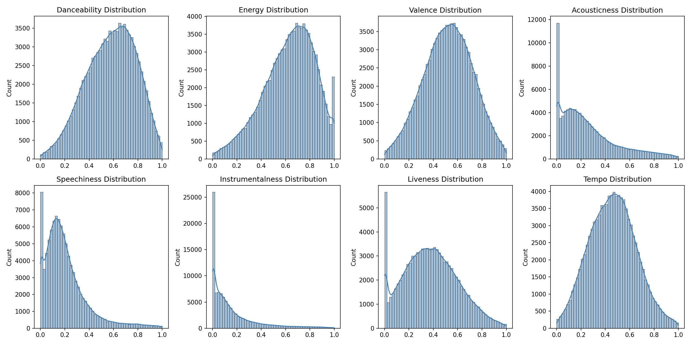
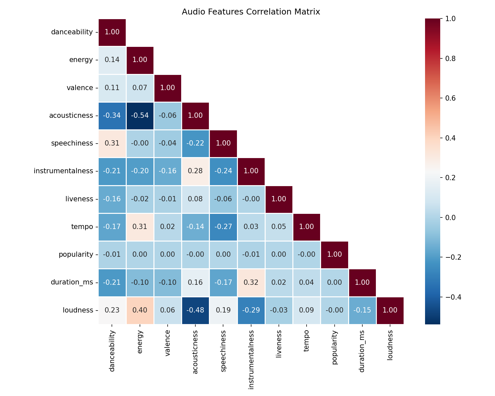
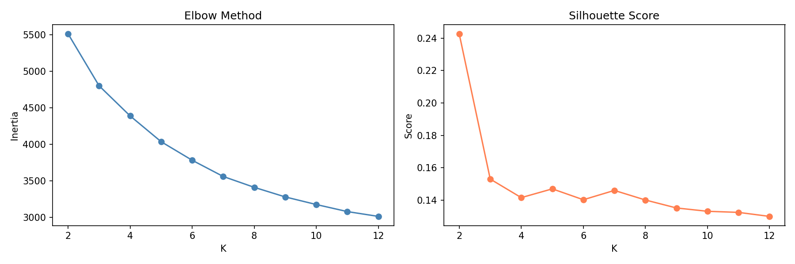
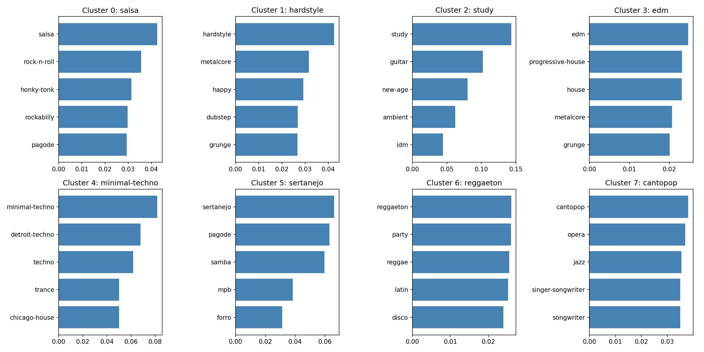

# Spotify Music Data Analysis & Recommendation System


An end-to-end data analysis and recommendation system built on **114,000 real Spotify tracks** across **114 genres**. Performs EDA, trend analysis, clustering, and hybrid recommendation, all presented through an interactive Streamlit dashboard.

---

## Dataset

**Source**: [Spotify Tracks Dataset](https://www.kaggle.com/datasets/maharshipandya/-spotify-tracks-dataset) on Kaggle

- 114,000 tracks | 114 genres | 31,437 artists
- Audio features: danceability, energy, valence, tempo, acousticness, instrumentalness, speechiness, liveness, loudness, key, mode, duration
- Track metadata: popularity score (0-100), explicit flag, artist names

---

## Features

| Module | Description |
|--------|-------------|
| **Data Pipeline** | Automated cleaning, outlier clipping, feature scaling, genre encoding |
| **EDA** | Feature distributions, genre profiles, correlation analysis, popularity insights |
| **Trend Analysis** | Genre share distribution, audio feature comparison, explicit content ratio |
| **Clustering** | KMeans (K=8), PCA & t-SNE visualization, genre composition per cluster |
| **Hybrid Recommender** | Content-based (cosine similarity) + popularity-weighted + genre-filtered recommendations |
| **Streamlit Dashboard** | 5-page interactive web app for visual exploration |

---

## Project Structure

```
music_analysis1/
├── data/
│   ├── raw/                    # Raw Kaggle dataset (gitignored)
│   └── processed/              # Cleaned & feature-engineered data (parquet)
├── notebooks/                  # Analysis scripts & visualizations
│   ├── 01_eda.py               # Feature distributions, correlations, genre radar
│   ├── 02_trend_analysis.py    # Genre share, explicit content, duration trends
│   ├── 03a_kmeans_pca.py       # KMeans clustering + PCA dimensionality reduction
│   ├── 03b_tsne.py             # t-SNE visualization
│   └── 04_recommendation.py    # Recommendation demo
├── src/
│   ├── clean_data.py           # Data cleaning pipeline
│   ├── features.py             # Feature engineering (scaling, encoding)
│   ├── recommender.py          # Hybrid recommendation engine
│   └── generate_data.py        # Synthetic data generator (fallback)
├── models/                     # Saved encoders & scalers
├── app.py                      # Streamlit dashboard
├── requirements.txt            # Pinned dependencies
└── README.md
```

---

## Quick Start

### 1. Clone & Install

```bash
git clone https://github.com/Imaginer8/music_analysis1.git
cd music_analysis1
pip install -r requirements.txt
```

### 2. Run Analysis Notebooks

```bash
python notebooks/01_eda.py
python notebooks/02_trend_analysis.py
python notebooks/03a_kmeans_pca.py
```

### 3. Launch Dashboard

```bash
streamlit run app.py
```

---

## Key Findings

- **114 distinct genres** in the dataset, with pop, rock, and hip-hop being the most prevalent
- **Audio features vary significantly by genre** — each genre has a distinct "sonic fingerprint" enabling accurate classification
- **8 musical style clusters** identified via KMeans, with clear genre affinities per cluster
- **Popularity is long-tail** — most tracks have low popularity, with a small number of hits dominating
- **Explicit content** is genre-dependent, with highest proportions in hip-hop and rap
- **Shorter song durations** correlate with danceability and energy

---

## Tech Stack

| Component | Technology |
|-----------|-----------|
| Language | Python 3.12 |
| Data Processing | Pandas, NumPy |
| Machine Learning | Scikit-learn (KMeans, PCA, t-SNE) |
| Visualization | Matplotlib, Seaborn, Plotly |
| Web App | Streamlit |
| Storage | Parquet (compressed columnar) |

---

## Demo


*Audio feature distributions across the dataset*


*Feature correlation heatmap*


*Optimal K selection for KMeans clustering*


*Top genres per cluster*

---

## License

MIT
